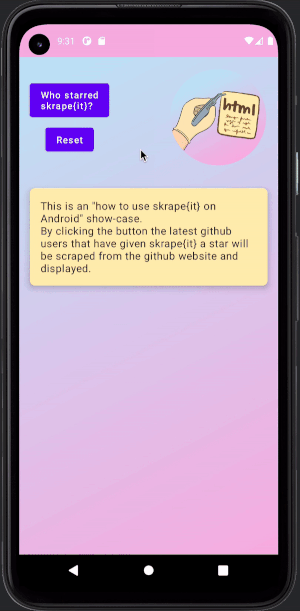

# skrape{it} Android Example

This is an Android sample of use of the skrape{it} library on Android with jetpack-compose.

## The show-case
By clicking the button the latest github users that have given skrape{it} a star will be scraped from the github website and displayed.



## Configuring the environment

The fist step to be able to run, is to setup the JVM to target at least JAVA 8.
To do that, on your app level build.gradle, add these configurations:

```gradle
android {
    // Other android setups

    compileOptions {
        sourceCompatibility JavaVersion.VERSION_1_8
        targetCompatibility JavaVersion.VERSION_1_8
    }

    kotlinOptions {
        jvmTarget = "1.8"
    }
}
```

After that, you need to exclude the `META-INF/DEPENDENCIES` from the android packaging.

```gradle
android {
    // Other android setups

    // JVM setup

    packagingOptions {
        exclude 'META-INF/DEPENDENCIES'
    }
}
```

Last but not least, import the skrape library.

```gradle
dependencies {
    implementation "it.skrape:skrapeit:$skrape_version"
}
```

After all of that, you can just use the library as usual:

```kotlin
    fun parse(html: String) {
        val parsedHtml = htmlDocument(html)

        _titleLiveData.postValue(parsedHtml.titleText)
        parsedHtml.findAll("li")
            .map { it.text }
            .let(_itemsLiveData::postValue)
    }
```

## Troubleshooting
### missing Internet persmission
If you want to use one of skrape{it}s Http-Client implementations to fetch html directly / dynamically from the web make sure that you have added internet permission in your `AndroidManifest.xml`:

```xml
<uses-permission android:name="android.permission.INTERNET" />
```

### android.os.NetworkOnMainThreadException
If you are using a blocking fetcher implementation like `HttpFetcher` or `BrowserFetcher` you need to run the fetcher call in a background thread, e.g.:

```kotlin
private suspend fun fetch(): List<User> =
    withContext(Dispatchers.IO) {
        skrape(HttpFetcher) {
            request {
                url = "https://some.fancy/url"
            }
            extract {
                htmlDocument {
                ...
```
